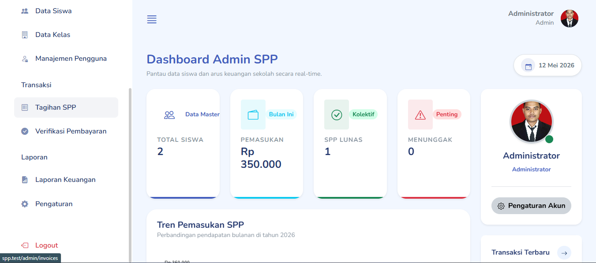
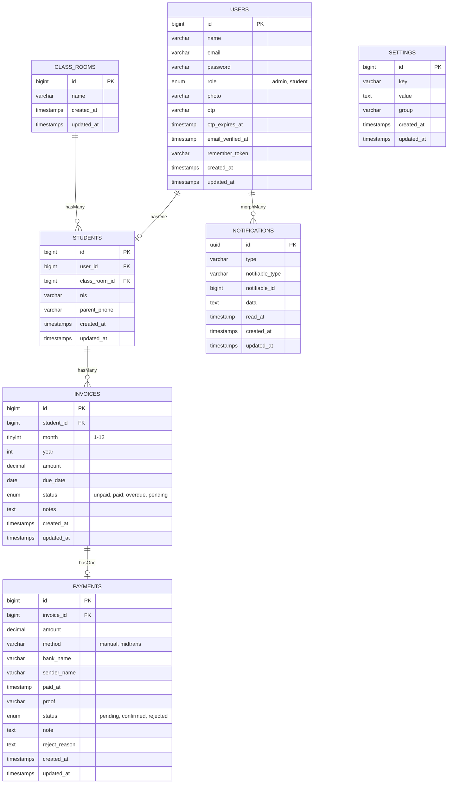

# 🏫 Sistem Informasi Pembayaran SPP Sekolah

<p align="center">
  
  
  
  
</p>

<p align="center">
  Sistem Informasi Pembayaran SPP (Sumbangan Pembinaan Pendidikan) berbasis web yang dibangun dengan <strong>Laravel 13</strong>. Mendukung manajemen tagihan, verifikasi pembayaran manual, integrasi payment gateway Midtrans, dan notifikasi WhatsApp otomatis via Fonnte API.
</p>

---

## 📋 Daftar Isi

- [Fitur Utama](#-fitur-utama)
- [Tangkapan Layar](#-tangkapan-layar)
- [Entity Relationship Diagram (ERD)](#-entity-relationship-diagram-erd)
- [Struktur Database](#-struktur-database)
- [Teknologi yang Digunakan](#-teknologi-yang-digunakan)
- [Persyaratan Sistem](#-persyaratan-sistem)
- [Cara Instalasi](#-cara-instalasi)
- [Konfigurasi](#-konfigurasi)
- [Struktur Direktori](#-struktur-direktori)
- [Alur Aplikasi](#-alur-aplikasi)
- [API & Integrasi](#-api--integrasi)
- [Kontribusi](#-kontribusi)
- [Lisensi](#-lisensi)

---

## ✨ Fitur Utama

### 🔐 Autentikasi & Keamanan
- Login multi-role (**Admin** & **Siswa**)
- Registrasi mandiri untuk siswa baru
- **Reset password via OTP WhatsApp** (kode berlaku 60 menit)
- Notifikasi WhatsApp otomatis saat registrasi berhasil
- Proteksi CSRF pada semua form

### 👨‍💼 Panel Admin
| Fitur | Deskripsi |
|-------|-----------|
| Dashboard | Statistik real-time: total siswa, pemasukan bulan ini, SPP lunas, siswa menunggak |
| Tren Pemasukan | Grafik area interaktif bulanan menggunakan ApexCharts |
| Manajemen Siswa | CRUD lengkap + import/export Excel + bulk delete |
| Manajemen Kelas | CRUD data kelas |
| Manajemen Pengguna | CRUD akun (Admin & Siswa) + reset password default |
| Tagihan SPP | Generate tagihan massal, kelola status, cetak PDF invoice |
| Verifikasi Pembayaran | Approve/reject bukti transfer manual dari siswa |
| Laporan Keuangan | Filter per bulan/tahun + ekspor PDF |
| Pengaturan Sistem | Logo, warna brand, konfigurasi Midtrans, token WhatsApp |
| Test Notifikasi | Alat uji kirim notifikasi WhatsApp dari panel admin |

### 👨‍🎓 Portal Siswa
| Fitur | Deskripsi |
|-------|-----------|
| Dashboard | Ringkasan tagihan, status pembayaran, notifikasi terbaru |
| Daftar Tagihan | Lihat semua tagihan per bulan, status, dan riwayat |
| Upload Bukti Bayar | Wizard 3-langkah untuk upload bukti transfer manual |
| Pembayaran Online | Integrasi Midtrans Snap untuk pembayaran online |
| Notifikasi | Pusat notifikasi (approve, reject, pengingat tagihan) |
| Profil | Edit data profil dan ganti foto |
| Timeline | Riwayat aktivitas pembayaran |

### 📲 Notifikasi WhatsApp (Fonnte API)
- Notifikasi registrasi akun baru
- Notifikasi pembayaran dikonfirmasi/ditolak
- OTP lupa password
- Pengingat tagihan jatuh tempo

### 📄 Laporan & PDF
- Invoice PDF per tagihan (dengan lokalisasi tanggal Bahasa Indonesia)
- Laporan keuangan bulanan dalam format PDF
- Cetak langsung dari browser

---

## 📸 Tangkapan Layar

### Halaman Login
> Halaman login dengan desain modern dua kolom, panel kiri berisi form dan panel kanan menampilkan fitur unggulan sistem.

<!-- Sisipkan screenshot halaman login di sini -->
<!--  -->


### Halaman Registrasi
> Form pendaftaran akun siswa baru. Wajib mengisi Nomor WhatsApp aktif untuk menerima notifikasi dan OTP reset password.

<!-- Sisipkan screenshot halaman registrasi di sini -->
<!--  -->


### Halaman Lupa Password
> Alur reset password berbasis WhatsApp OTP 3 langkah: masukkan nomor WA → verifikasi kode OTP → buat password baru.

<!-- Sisipkan screenshot halaman lupa password di sini -->
<!--  -->


### Dashboard Admin
> Panel admin dengan kartu statistik real-time, grafik tren pemasukan bulanan, dan daftar transaksi terbaru.

<!-- Sisipkan screenshot dashboard admin di sini -->
<!--  -->




### Manajemen Pengguna (Admin)
> Tabel manajemen akun dengan fitur filter role, pencarian, edit, reset password, dan hapus akun.

<!-- Sisipkan screenshot halaman manajemen pengguna di sini -->
<!--  -->


### Verifikasi Pembayaran (Admin)
> Admin dapat melihat bukti transfer yang diupload siswa dan melakukan approve atau reject.

<!-- Sisipkan screenshot halaman verifikasi pembayaran di sini -->
<!--  -->


### Dashboard Siswa
> Portal siswa dengan ringkasan tagihan aktif, riwayat pembayaran, dan notifikasi terbaru.

<!-- Sisipkan screenshot dashboard siswa di sini -->
<!--  -->


### Upload Bukti Pembayaran (Siswa)
> Wizard langkah demi langkah untuk siswa mengunggah bukti transfer pembayaran manual.

<!-- Sisipkan screenshot halaman upload pembayaran di sini -->
<!--  -->


### Laporan Keuangan
> Laporan pemasukan per bulan dengan ringkasan statistik dan tombol ekspor PDF.

<!-- Sisipkan screenshot halaman laporan di sini -->
<!--  -->


## 🗂️ Entity Relationship Diagram (ERD)



---

## 🗄️ Struktur Database

### Tabel `users`
| Kolom | Tipe | Keterangan |
|-------|------|------------|
| `id` | bigint | Primary Key |
| `name` | varchar(255) | Nama lengkap |
| `email` | varchar(255) | Email unik |
| `password` | varchar(255) | Password (hashed) |
| `role` | enum | `admin` atau `student` |
| `photo` | varchar | Nama file foto profil |
| `otp` | varchar | Kode OTP reset password |
| `otp_expires_at` | timestamp | Waktu kadaluarsa OTP |

### Tabel `students`
| Kolom | Tipe | Keterangan |
|-------|------|------------|
| `id` | bigint | Primary Key |
| `user_id` | bigint | FK → users.id |
| `class_room_id` | bigint | FK → class_rooms.id |
| `nis` | varchar(20) | Nomor Induk Siswa (unik) |
| `parent_phone` | varchar(20) | Nomor WhatsApp orang tua/siswa |

### Tabel `class_rooms`
| Kolom | Tipe | Keterangan |
|-------|------|------------|
| `id` | bigint | Primary Key |
| `name` | varchar(255) | Nama kelas (contoh: X IPA 1) |

### Tabel `invoices`
| Kolom | Tipe | Keterangan |
|-------|------|------------|
| `id` | bigint | Primary Key |
| `student_id` | bigint | FK → students.id |
| `month` | tinyint | Bulan tagihan (1-12) |
| `year` | int | Tahun tagihan |
| `amount` | decimal(15,2) | Jumlah tagihan SPP |
| `due_date` | date | Tanggal jatuh tempo |
| `status` | enum | `unpaid`, `paid`, `overdue`, `pending` |
| `notes` | text | Catatan tambahan |

### Tabel `payments`
| Kolom | Tipe | Keterangan |
|-------|------|------------|
| `id` | bigint | Primary Key |
| `invoice_id` | bigint | FK → invoices.id |
| `amount` | decimal(15,2) | Jumlah yang dibayarkan |
| `method` | varchar | `manual` atau `midtrans` |
| `bank_name` | varchar | Nama bank pengirim |
| `sender_name` | varchar | Nama pengirim transfer |
| `paid_at` | timestamp | Waktu pembayaran |
| `proof` | varchar | Nama file bukti transfer |
| `status` | enum | `pending`, `confirmed`, `rejected` |
| `note` | text | Catatan siswa |
| `reject_reason` | text | Alasan penolakan oleh admin |

### Tabel `settings`
| Kolom | Tipe | Keterangan |
|-------|------|------------|
| `key` | varchar | Kunci pengaturan |
| `value` | text | Nilai pengaturan |
| `group` | varchar | Kelompok pengaturan (general, payment, notification) |

**Daftar kunci pengaturan penting:**

| Key | Keterangan |
|-----|------------|
| `school_name` | Nama sekolah |
| `school_logo` | File logo sekolah |
| `favicon` | File favicon |
| `primary_color` | Warna utama antarmuka (hex) |
| `spp_amount` | Nominal SPP default |
| `bank_name` | Nama bank tujuan pembayaran |
| `bank_account` | Nomor rekening tujuan |
| `bank_holder` | Nama pemilik rekening |
| `midtrans_server_key` | Server Key Midtrans |
| `midtrans_client_key` | Client Key Midtrans |
| `midtrans_env` | `sandbox` atau `production` |
| `wa_active` | Aktifkan WhatsApp (`1`/`0`) |
| `wa_token` | Token API Fonnte |
| `wa_sender` | Nomor pengirim WhatsApp |

---

## 🛠️ Teknologi yang Digunakan

| Kategori | Teknologi |
|----------|-----------|
| **Framework** | Laravel 13.x (PHP 8.3) |
| **Database** | MySQL 8.0 |
| **Frontend** | Bootstrap 5.3, Mazer Template |
| **Ikon** | Bootstrap Icons, Iconly |
| **Chart** | ApexCharts |
| **Alert/Notif UI** | SweetAlert2 |
| **PDF** | Barryvdh/Laravel-DomPDF |
| **Excel** | Maatwebsite/Laravel-Excel |
| **Payment Gateway** | Midtrans Snap |
| **WhatsApp API** | Fonnte API |
| **Storage** | Laravel Storage (local/public) |

---

## 📦 Persyaratan Sistem

- PHP >= 8.2 dengan ekstensi: `mbstring`, `openssl`, `pdo`, `tokenizer`, `xml`, `ctype`, `json`, `bcmath`, `gd`
- Composer >= 2.x
- MySQL >= 8.0
- Node.js >= 18.x (opsional, jika ingin build aset)
- Web server: Nginx / Apache / Laragon (untuk lokal)

---

## 🚀 Cara Instalasi

### 1. Clone Repository
```bash
git clone https://github.com/username/spp-sekolah.git
cd spp-sekolah
```

### 2. Install Dependensi PHP
```bash
composer install
```

### 3. Salin File Konfigurasi
```bash
cp .env.example .env
php artisan key:generate
```

### 4. Konfigurasi Database
Edit file `.env` dan sesuaikan kredensial database Anda:
```env
DB_CONNECTION=mysql
DB_HOST=127.0.0.1
DB_PORT=3306
DB_DATABASE=spp_sekolah
DB_USERNAME=root
DB_PASSWORD=
```

### 5. Jalankan Migrasi & Seeder
```bash
php artisan migrate
php artisan db:seed
```

### 6. Buat Symlink Storage
```bash
php artisan storage:link
```

### 7. Jalankan Aplikasi
```bash
php artisan serve
```

Akses aplikasi di: `http://localhost:8000`

---

## ⚙️ Konfigurasi

### Konfigurasi Midtrans
Isi nilai berikut di `.env` atau melalui halaman **Admin > Pengaturan > Tab Pembayaran**:
```env
MIDTRANS_SERVER_KEY=your_server_key
MIDTRANS_CLIENT_KEY=your_client_key
MIDTRANS_ENV=sandbox  # atau production
```

### Konfigurasi WhatsApp (Fonnte)
1. Daftarkan perangkat di [fonnte.com](https://fonnte.com)
2. Dapatkan token API
3. Isi di **Admin > Pengaturan > Tab Notifikasi**:

| Field | Keterangan |
|-------|------------|
| **Token Fonnte** | Token API dari dashboard Fonnte |
| **Nomor Pengirim** | Nomor WhatsApp yang terdaftar di Fonnte |
| **Aktifkan WA** | Toggle untuk mengaktifkan/menonaktifkan |

### Konfigurasi Timezone & Locale
Di file `config/app.php`:
```php
'timezone' => 'Asia/Jakarta',
'locale'   => 'id',
'faker_locale' => 'id_ID',
```

---

## 📁 Struktur Direktori

```
spp/
├── app/
│   ├── Http/
│   │   ├── Controllers/
│   │   │   ├── AuthController.php          # Login, Register, OTP Reset Password
│   │   │   ├── Backend/
│   │   │   │   ├── DashboardController.php # Dashboard Admin
│   │   │   │   ├── StudentController.php   # Manajemen Siswa
│   │   │   │   ├── ClassRoomController.php # Manajemen Kelas
│   │   │   │   ├── InvoiceController.php   # Manajemen Tagihan
│   │   │   │   ├── PaymentController.php   # Verifikasi Pembayaran
│   │   │   │   ├── ReportController.php    # Laporan Keuangan
│   │   │   │   ├── SettingController.php   # Pengaturan Sistem
│   │   │   │   ├── UserController.php      # Manajemen Pengguna
│   │   │   │   ├── PdfController.php       # Ekspor PDF
│   │   │   │   └── ProfileController.php   # Profil Admin
│   │   │   └── Siswa/
│   │   │       ├── DashboardController.php # Dashboard Siswa
│   │   │       ├── InvoiceController.php   # Tagihan Siswa
│   │   │       ├── PaymentController.php   # Upload Bukti Bayar
│   │   │       ├── ProfileController.php   # Profil Siswa
│   │   │       └── TimelineController.php  # Timeline Pembayaran
│   ├── Models/
│   │   ├── User.php
│   │   ├── Student.php
│   │   ├── ClassRoom.php
│   │   ├── Invoice.php
│   │   ├── Payment.php
│   │   └── Setting.php
│   ├── Notifications/
│   │   └── PaymentStatusNotification.php   # Notifikasi status pembayaran
│   └── Services/
│       └── WhatsappService.php             # Layanan kirim WA via Fonnte
├── database/
│   ├── migrations/                         # Semua file migrasi
│   └── seeders/                            # Seeder data awal
├── resources/
│   └── views/
│       ├── auth/                           # Login, Register, Forgot Password, OTP, Reset
│       ├── backend/                        # Semua tampilan panel Admin
│       │   ├── layouts/                    # Master, Sidebar, Navbar, Footer
│       │   ├── dashboard/
│       │   ├── students/
│       │   ├── classes/
│       │   ├── invoices/
│       │   ├── payments/
│       │   ├── reports/
│       │   ├── settings/
│       │   └── users/
│       ├── siswa/                          # Semua tampilan Portal Siswa
│       │   ├── layouts/
│       │   ├── dashboard.blade.php
│       │   ├── invoices/
│       │   ├── payments/
│       │   └── notifications.blade.php
│       └── pdf/                            # Template PDF invoice & laporan
│           ├── invoice.blade.php
│           └── report.blade.php
└── routes/
    └── web.php                             # Semua definisi route
```

---

## 🔄 Alur Aplikasi

### Alur Pembayaran Manual
```
Siswa → Lihat Tagihan → Upload Bukti Transfer (Wizard 3 Langkah)
  └→ Admin menerima notifikasi → Review Bukti
       ├→ [Approve] → Status "Lunas" + Notifikasi WA ke Siswa
       └→ [Reject]  → Status "Belum Bayar" + Notifikasi WA + Alasan Penolakan
```

### Alur Pembayaran Online (Midtrans)
```
Siswa → Klik "Bayar Online" → Midtrans Snap Pop-up
  └→ Bayar via Bank/E-Wallet/QRIS
       └→ Midtrans Webhook → Otomatis konfirmasi → Status "Lunas"
```

### Alur Reset Password via OTP
```
Klik "Lupa Password?" → Masukkan Nomor WA Terdaftar
  └→ Sistem kirim 6 digit OTP via WhatsApp (berlaku 60 menit)
       └→ Masukkan OTP → Buat Password Baru → Login
```

---

## 🔌 API & Integrasi

### Fonnte WhatsApp API
- **Endpoint**: `https://api.fonnte.com/send`
- **Method**: POST
- **Header**: `Authorization: {token}`
- **Payload**: `target`, `message`, `countryCode`

### Midtrans
- **Mode Sandbox**: `https://app.sandbox.midtrans.com`
- **Mode Production**: `https://app.midtrans.com`
- **Webhook**: `/payments/midtrans-notification` *(tidak butuh autentikasi)*

---

## 👤 Akun Default Setelah Seeder

| Role | Email | Password |
|------|-------|----------|
| Admin | `admin@sekolah.com` | `password` |
| Siswa | `siswa@sekolah.com` | `password` |

> ⚠️ Segera ganti password setelah instalasi pertama!

---

## 🤝 Kontribusi

Kontribusi sangat diterima! Silakan ikuti langkah berikut:

1. Fork repository ini
2. Buat branch fitur baru: `git checkout -b fitur/nama-fitur`
3. Commit perubahan: `git commit -m 'Tambah fitur X'`
4. Push ke branch: `git push origin fitur/nama-fitur`
5. Buat Pull Request

---

## 📄 Lisensi

Proyek ini dilisensikan di bawah [MIT License](LICENSE).
# spp

