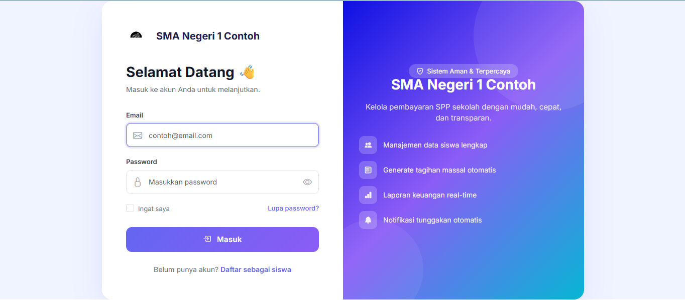
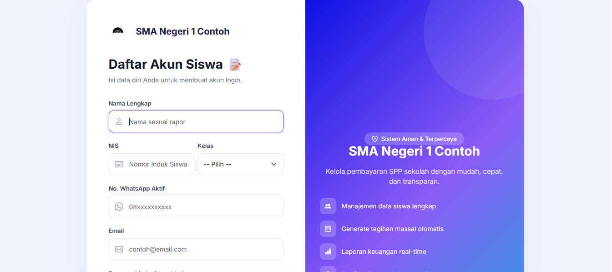
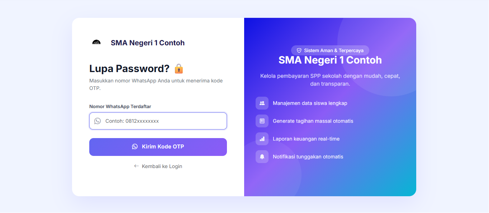
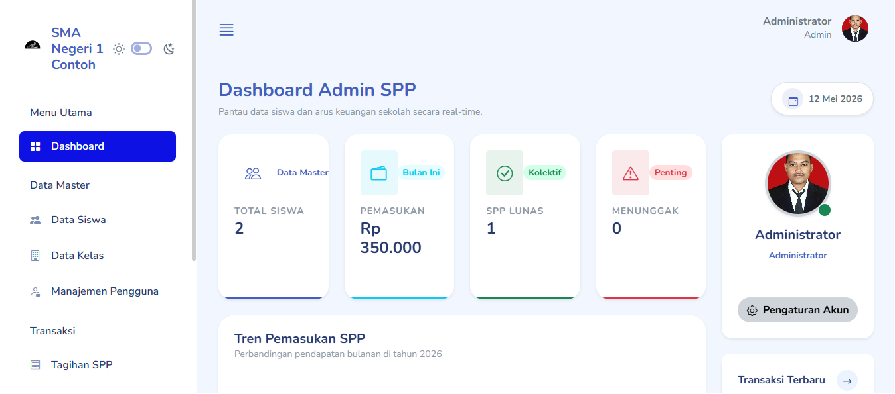
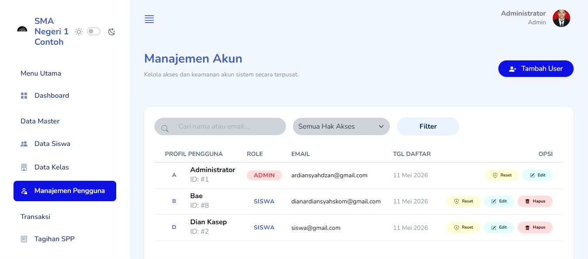
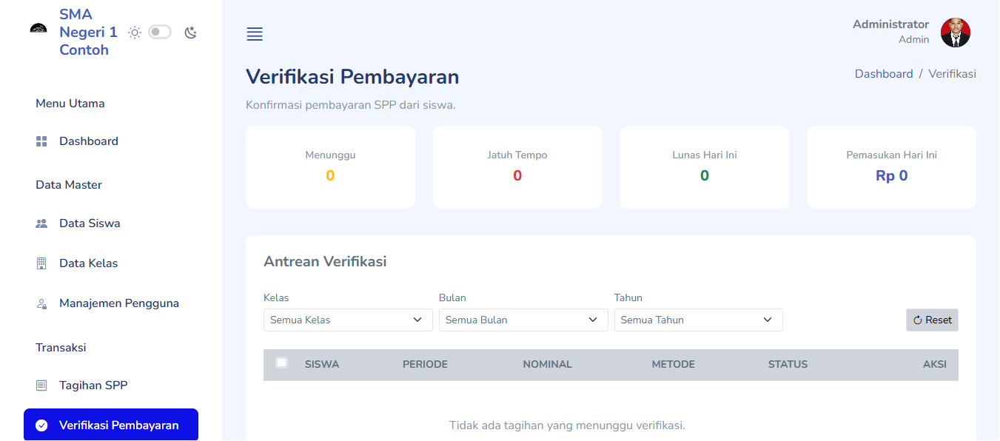
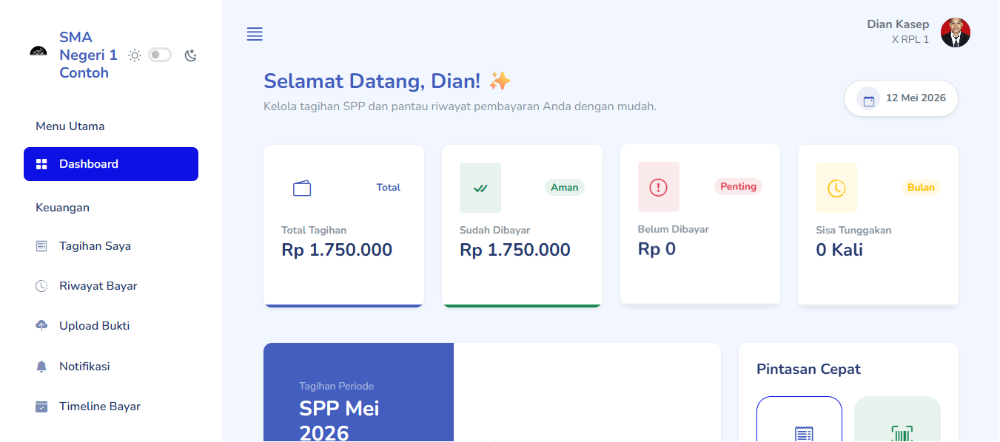
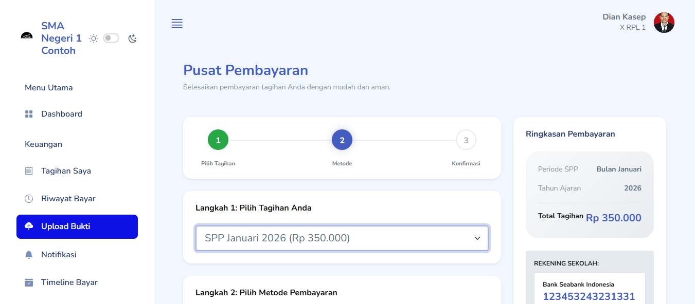
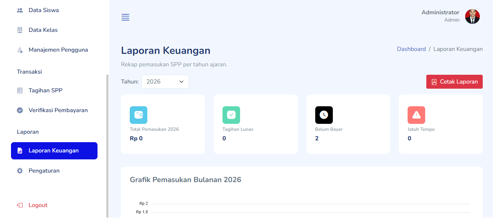
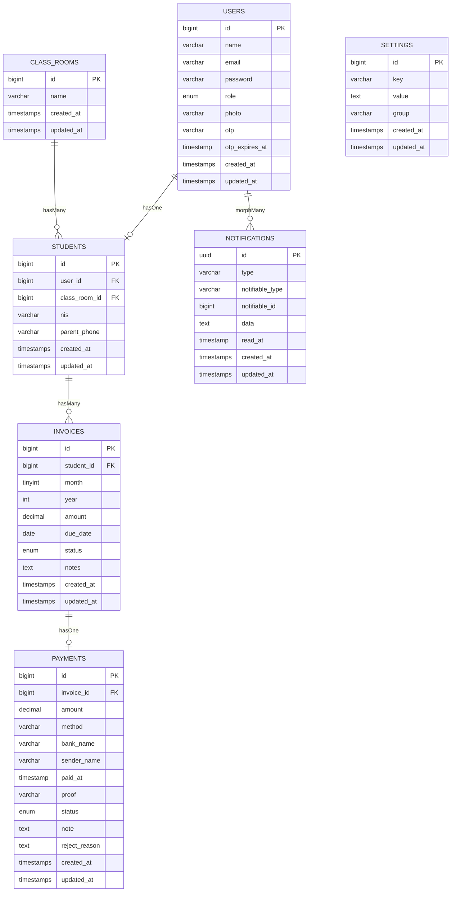

# Sistem Informasi Pembayaran SPP Sekolah

[](https://laravel.com)
[](https://php.net)
[](https://mysql.com)
[](https://getbootstrap.com)

Sistem Informasi Pembayaran SPP berbasis web dibangun dengan **Laravel 13**. Mendukung manajemen tagihan, verifikasi pembayaran manual, integrasi Midtrans, dan notifikasi WhatsApp otomatis via Fonnte API.

---

## Daftar Isi

- [Fitur Utama](#fitur-utama)
- [Tangkapan Layar](#tangkapan-layar)
- [Entity Relationship Diagram](#entity-relationship-diagram-erd)
- [Struktur Database](#struktur-database)
- [Teknologi](#teknologi-yang-digunakan)
- [Instalasi](#cara-instalasi)
- [Konfigurasi](#konfigurasi)
- [Alur Aplikasi](#alur-aplikasi)
- [Kontribusi](#kontribusi)

---

## Fitur Utama

### Autentikasi dan Keamanan

- Login multi-role (Admin dan Siswa)
- Registrasi mandiri siswa baru
- Reset password via OTP WhatsApp (berlaku 60 menit)
- Notifikasi WhatsApp otomatis saat registrasi
- Proteksi CSRF pada semua form

### Panel Admin

| Fitur | Deskripsi |
|-------|-----------|
| Dashboard | Statistik real-time: total siswa, pemasukan bulan ini, SPP lunas, menunggak |
| Tren Pemasukan | Grafik area interaktif bulanan (ApexCharts) |
| Manajemen Siswa | CRUD + import/export Excel + bulk delete |
| Manajemen Kelas | CRUD data kelas |
| Manajemen Pengguna | CRUD akun (Admin & Siswa) + reset password default |
| Tagihan SPP | Generate massal, kelola status, cetak PDF invoice |
| Verifikasi Pembayaran | Approve/reject bukti transfer manual dari siswa |
| Laporan Keuangan | Filter per bulan/tahun + ekspor PDF |
| Pengaturan Sistem | Logo, warna brand, konfigurasi Midtrans, token WhatsApp |
| Test Notifikasi | Alat uji kirim WA dari panel admin |

### Portal Siswa

| Fitur | Deskripsi |
|-------|-----------|
| Dashboard | Ringkasan tagihan, status pembayaran, notifikasi terbaru |
| Daftar Tagihan | Lihat semua tagihan per bulan beserta status |
| Upload Bukti Bayar | Wizard 3-langkah untuk upload bukti transfer |
| Pembayaran Online | Integrasi Midtrans Snap |
| Notifikasi | Pusat notifikasi in-app |
| Profil | Edit data profil dan ganti foto |
| Timeline | Riwayat aktivitas pembayaran |

### Notifikasi WhatsApp via Fonnte API

- Notifikasi registrasi akun baru
- Notifikasi pembayaran dikonfirmasi/ditolak
- OTP lupa password
- Pengingat tagihan jatuh tempo

---

## Tangkapan Layar

### Halaman Login

> Halaman login desain modern dua kolom. Panel kiri berisi form, panel kanan menampilkan fitur unggulan sistem.

<!--  -->



### Halaman Registrasi

> Form pendaftaran akun siswa baru. Wajib mengisi nomor WhatsApp aktif untuk notifikasi dan OTP reset password.

<!--  -->



### Halaman Lupa Password

> Alur reset password berbasis WhatsApp OTP 3 langkah: masukkan nomor WA > verifikasi kode OTP > buat password baru.

<!--  -->
<!--  -->
<!--  -->



### Dashboard Admin

> Panel admin dengan kartu statistik real-time, grafik tren pemasukan bulanan, dan daftar transaksi terbaru.

<!--  -->



### Manajemen Pengguna

> Tabel manajemen akun dengan filter role, pencarian, edit, reset password, dan hapus akun.

<!--  -->



### Verifikasi Pembayaran

> Admin dapat melihat bukti transfer yang diupload siswa dan melakukan approve atau reject.

<!--  -->


### Dashboard Siswa

> Portal siswa dengan ringkasan tagihan aktif, riwayat pembayaran, dan notifikasi terbaru.

<!--  -->



### Upload Bukti Pembayaran

> Wizard langkah demi langkah untuk siswa mengunggah bukti transfer pembayaran manual.

<!--  -->



### Laporan Keuangan

> Laporan pemasukan per bulan dengan statistik dan tombol ekspor PDF.

<!--  -->



## Entity Relationship Diagram (ERD)



---

## Struktur Database

### Tabel `users`

| Kolom | Tipe | Keterangan |
|-------|------|------------|
| id | bigint | Primary Key |
| name | varchar(255) | Nama lengkap |
| email | varchar(255) | Email unik |
| password | varchar(255) | Password (hashed) |
| role | enum | `admin` atau `student` |
| photo | varchar | Nama file foto profil |
| otp | varchar | Kode OTP reset password |
| otp_expires_at | timestamp | Waktu kadaluarsa OTP |

### Tabel `students`

| Kolom | Tipe | Keterangan |
|-------|------|------------|
| id | bigint | Primary Key |
| user_id | bigint | FK ke users.id |
| class_room_id | bigint | FK ke class_rooms.id |
| nis | varchar(20) | Nomor Induk Siswa (unik) |
| parent_phone | varchar(20) | Nomor WhatsApp orang tua/siswa |

### Tabel `class_rooms`

| Kolom | Tipe | Keterangan |
|-------|------|------------|
| id | bigint | Primary Key |
| name | varchar(255) | Nama kelas, contoh: X IPA 1 |

### Tabel `invoices`

| Kolom | Tipe | Keterangan |
|-------|------|------------|
| id | bigint | Primary Key |
| student_id | bigint | FK ke students.id |
| month | tinyint | Bulan tagihan (1-12) |
| year | int | Tahun tagihan |
| amount | decimal(15,2) | Jumlah tagihan SPP |
| due_date | date | Tanggal jatuh tempo |
| status | enum | unpaid, paid, overdue, pending |
| notes | text | Catatan tambahan |

### Tabel `payments`

| Kolom | Tipe | Keterangan |
|-------|------|------------|
| id | bigint | Primary Key |
| invoice_id | bigint | FK ke invoices.id |
| amount | decimal(15,2) | Jumlah yang dibayarkan |
| method | varchar | manual atau midtrans |
| bank_name | varchar | Nama bank pengirim |
| sender_name | varchar | Nama pengirim transfer |
| paid_at | timestamp | Waktu pembayaran |
| proof | varchar | Nama file bukti transfer |
| status | enum | pending, confirmed, rejected |
| note | text | Catatan siswa |
| reject_reason | text | Alasan penolakan oleh admin |

### Tabel `settings`

| Kolom | Tipe | Keterangan |
|-------|------|------------|
| key | varchar | Kunci pengaturan |
| value | text | Nilai pengaturan |
| group | varchar | Kelompok: general, payment, notification |

**Kunci pengaturan penting:**

| Key | Keterangan |
|-----|------------|
| school_name | Nama sekolah |
| school_logo | File logo sekolah |
| primary_color | Warna utama antarmuka (hex) |
| spp_amount | Nominal SPP default |
| bank_name | Nama bank tujuan pembayaran |
| bank_account | Nomor rekening tujuan |
| bank_holder | Nama pemilik rekening |
| midtrans_server_key | Server Key Midtrans |
| midtrans_client_key | Client Key Midtrans |
| midtrans_env | sandbox atau production |
| wa_active | Aktifkan WhatsApp (1/0) |
| wa_token | Token API Fonnte |
| wa_sender | Nomor pengirim WhatsApp |

---

## Teknologi yang Digunakan

| Kategori | Teknologi |
|----------|-----------|
| Framework | Laravel 13.x (PHP 8.3) |
| Database | MySQL 8.0 |
| Frontend | Bootstrap 5.3, Mazer Template |
| Ikon | Bootstrap Icons, Iconly |
| Chart | ApexCharts |
| Alert UI | SweetAlert2 |
| PDF | Barryvdh/Laravel-DomPDF |
| Excel | Maatwebsite/Laravel-Excel |
| Payment Gateway | Midtrans Snap |
| WhatsApp API | Fonnte API |
| Storage | Laravel Storage (local/public) |

---

## Persyaratan Sistem

- PHP >= 8.2 dengan ekstensi: mbstring, openssl, pdo, tokenizer, xml, ctype, json, bcmath, gd
- Composer >= 2.x
- MySQL >= 8.0
- Node.js >= 18.x (opsional)
- Web server: Nginx / Apache / Laragon

---

## Cara Instalasi

### 1. Clone Repository

```bash
git clone https://github.com/OzanProject/spp.git
cd spp
```

### 2. Install Dependensi PHP

```bash
composer install
```

### 3. Salin File Konfigurasi

```bash
cp .env.example .env
php artisan key:generate
```

### 4. Konfigurasi Database

Edit file `.env`:

```env
DB_CONNECTION=mysql
DB_HOST=127.0.0.1
DB_PORT=3306
DB_DATABASE=spp_sekolah
DB_USERNAME=root
DB_PASSWORD=
```

### 5. Migrasi dan Seeder

```bash
php artisan migrate
php artisan db:seed
```

### 6. Symlink Storage

```bash
php artisan storage:link
```

### 7. Jalankan Aplikasi

```bash
php artisan serve
```

Akses di: `http://localhost:8000`

---

## Konfigurasi

### Midtrans

```env
MIDTRANS_SERVER_KEY=your_server_key
MIDTRANS_CLIENT_KEY=your_client_key
MIDTRANS_ENV=sandbox
```

### WhatsApp (Fonnte)

1. Daftar di [fonnte.com](https://fonnte.com)
2. Dapatkan token API
3. Isi di **Admin > Pengaturan > Tab Notifikasi**

### Timezone dan Locale

Di `config/app.php`:

```php
'timezone' => 'Asia/Jakarta',
'locale'   => 'id',
```

---

## Alur Aplikasi

### Pembayaran Manual

```
Siswa -> Lihat Tagihan -> Upload Bukti Transfer (Wizard 3 Langkah)
  -> Admin menerima notifikasi -> Review Bukti
       -> [Approve] -> Status Lunas + Notifikasi WA ke Siswa
       -> [Reject]  -> Status Belum Bayar + Notifikasi WA + Alasan
```

### Pembayaran Online (Midtrans)

```
Siswa -> Klik Bayar Online -> Midtrans Snap Pop-up
  -> Bayar via Bank/E-Wallet/QRIS
       -> Midtrans Webhook -> Otomatis konfirmasi -> Status Lunas
```

### Reset Password via OTP

```
Klik Lupa Password -> Masukkan Nomor WA Terdaftar
  -> Sistem kirim 6 digit OTP via WhatsApp (berlaku 60 menit)
       -> Masukkan OTP -> Buat Password Baru -> Login
```

---

## API dan Integrasi

### Fonnte WhatsApp API

- Endpoint: `https://api.fonnte.com/send`
- Method: POST
- Header: `Authorization: {token}`
- Payload: `target`, `message`, `countryCode`

### Midtrans

- Sandbox: `https://app.sandbox.midtrans.com`
- Production: `https://app.midtrans.com`
- Webhook: `/payments/midtrans-notification`

---

## Akun Default Setelah Seeder

| Role | Email | Password |
|------|-------|----------|
| Admin | admin@sekolah.com | password |
| Siswa | siswa@sekolah.com | password |

> Segera ganti password setelah instalasi pertama!

---

## Kontribusi

1. Fork repository ini
2. Buat branch: `git checkout -b fitur/nama-fitur`
3. Commit: `git commit -m 'Tambah fitur X'`
4. Push: `git push origin fitur/nama-fitur`
5. Buat Pull Request

---

## Lisensi

Proyek ini dilisensikan di bawah [MIT License](LICENSE).

---

Dibuat dengan Laravel dan Bootstrap